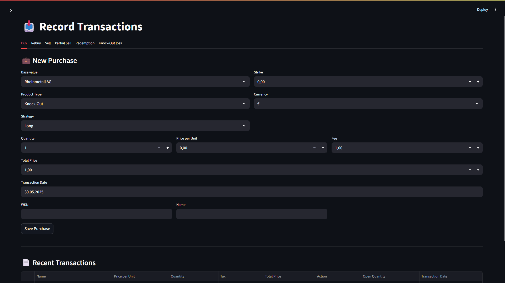
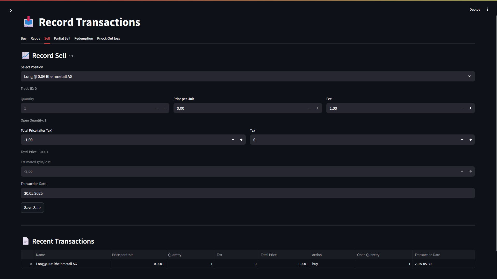
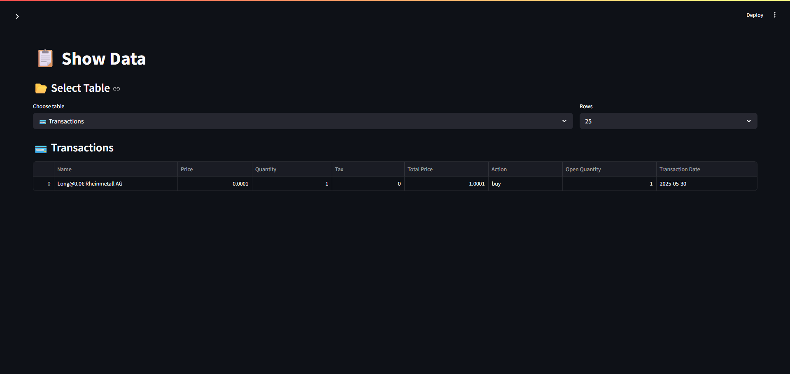
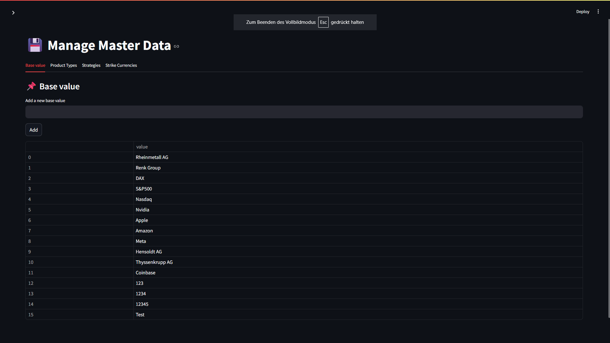
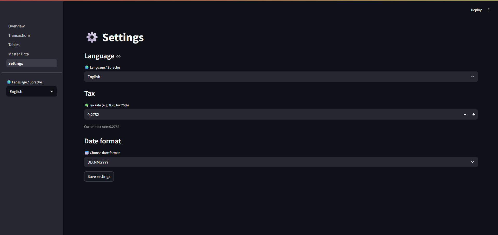

# 📈 OptionsTracker

An interactive tool for managing and analyzing leveraged products and derivative financial transactions — built with **Streamlit** and **SQLite**.

---

## 🖥️Interface Preview
| Buy                           | Sell                            | Transactions                            | Master Data                                      | Settings                                |
|-------------------------------|---------------------------------|-----------------------------------------|--------------------------------------------------|-----------------------------------------|
|  |  |  |  |  |


---

## 🚀 Features

- ✅ Record transactions: Buy / Rebuy / Partial Sell / Sell / Redemption / Knock-Out
- ✅ FIFO-based tax and gain/loss calculations
- ✅ Product deduplication & validation logic
- ✅ Normalized database structure (SQLite)
- ✅ Fully interactive **Streamlit UI**
- ✅ Displays recent transactions in real time
- ✅ Sortable and exportable tables (CSV)

---

## 🧰 Tech Stack

- **Frontend:** Streamlit (Python)
- **Database:** SQLite
- **Libraries:** pandas, datetime, sqlite3

---

## 📦 Installation

```bash
# 1. Clone the repository
git clone https://github.com/your-username/optionstracker.git
cd optionstracker

# 2. (Optional) Create a virtual environment
python -m venv .venv
source .venv/bin/activate  # or .venv\Scripts\activate on Windows

# 3. Install dependencies
pip install -r requirements.txt

# 4. Launch the app
streamlit run 1_Overview.py
