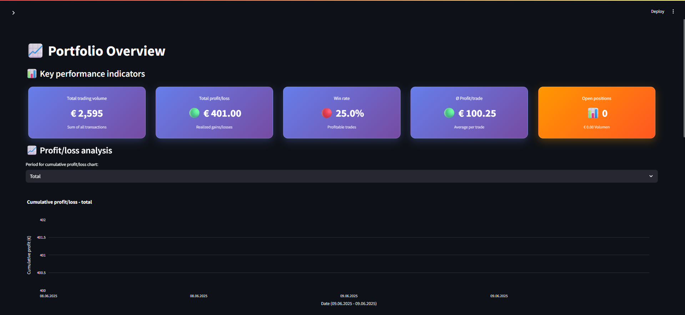

# Options Tracker 📈

An interactive tool for managing and analyzing leveraged products and derivative financial transactions — built with Streamlit and SQLite.




## Features ✨

- ✅ **Record transactions**: Buy / Rebuy / Partial Sell / Sell / Redemption / Knock-Out
- ✅ **FIFO-based tax and gain/loss calculations** (compliant with German tax law)
- ✅ **Product deduplication & validation logic**
- ✅ **Normalized database structure** (SQLite)
- ✅ **Fully interactive Streamlit UI**
- ✅ **Real-time transaction display**
- ✅ **Sortable and exportable tables** (CSV)
- ✅ **Docker support** for easy deployment
- ✅ **Automatic backup system**

## Screenshots 📸

| Buy | Sell | Transactions | Master Data | Settings |
|-----|------|--------------|-------------|----------|
|  |  |  |  |  |

## Tech Stack 🛠️

- **Frontend**: Streamlit (Python)
- **Database**: SQLite
- **Libraries**: pandas, datetime, sqlite3
- **Deployment**: Docker & Docker Compose

## Quick Start 🚀

### Option 1: Docker (Recommended)

```bash
# 1. Clone the repository
git clone https://github.com/Hilsre/options_tracker.git
cd options_tracker

# 2. Start with Docker Compose
make run
# or
docker-compose up -d

# 3. Open your browser
# http://localhost:8501
```

### Option 2: Local Installation

```bash
# 1. Clone the repository
git clone https://github.com/Hilsre/options_tracker.git
cd options_tracker

# 2. (Optional) Create a virtual environment
python -m venv .venv
source .venv/bin/activate  # or .venv\Scripts\activate on Windows

# 3. Install dependencies
pip install -r requirements.txt

# 4. Launch the app
streamlit run 1_Overview.py
```

## Docker Commands 🐳

The project includes a convenient Makefile for Docker operations:

```bash
# Build the application
make build

# Start the application
make run

# View logs
make logs

# Stop the application
make stop

# Create manual backup
make backup

# Development mode (with live reload)
make dev

# Clean up Docker resources
make clean

# Open shell in container
make shell

# Check application health
make health

# Show all available commands
make help
```

### Docker Compose Services

- **options-tracker**: Main Streamlit application
- **backup-service**: Automatic database backup service (runs every 24h)

## Data Persistence 💾

When using Docker, your data is automatically persisted in local directories:

- `./data/` - SQLite database files
- `./backups/` - Automatic and manual backups
- `./logs/` - Application logs

## Development 👨‍💻

### Development Mode

```bash
# Start in development mode with live reload
make dev
```

This will:
- Mount your source code into the container
- Enable automatic reloading on file changes
- Disable the backup service for faster startup

### Project Structure

```
options_tracker/
├── 1_Overview.py          # Main Streamlit app
├── pages/                 # Streamlit pages
├── data/                  # SQLite database (persistent)
├── backups/              # Database backups (persistent)
├── images/               # Screenshots and assets
├── requirements.txt      # Python dependencies
├── Dockerfile           # Docker configuration
├── docker-compose.yml   # Docker Compose setup
├── Makefile            # Convenience commands
└── README.md           # This file
```

## Configuration ⚙️

### Environment Variables

You can customize the application using environment variables:

```bash
# Database configuration
DATABASE_PATH=/app/data/options_tracker.db

# Streamlit configuration
STREAMLIT_SERVER_ADDRESS=0.0.0.0
STREAMLIT_SERVER_PORT=8501
STREAMLIT_SERVER_HEADLESS=true

# Backup configuration
BACKUP_INTERVAL=24h  # Backup interval for automatic backups
```

### Custom Configuration

Create a `.env` file in the project root:

```env
DATABASE_PATH=./custom_data/my_database.db
BACKUP_INTERVAL=12h
```

## Backup & Restore 🔄

### Automatic Backups

The Docker setup includes an automatic backup service that:
- Creates daily backups of your database
- Stores backups in `./backups/` directory
- Automatically removes backups older than 30 days

### Manual Backup

```bash
# Create a manual backup
make backup

# List available backups
make restore
```

### Restore from Backup

```bash
# Stop the application
make stop

# Copy backup to data directory
cp ./backups/backup_YYYYMMDD_HHMMSS.db ./data/options_tracker.db

# Restart the application
make run
```

## Security Considerations 🔒

- The application runs with a non-root user in Docker
- Database files are stored locally (not in the container)
- No external network access required for core functionality
- Health checks ensure application stability

## Troubleshooting 🔧

### Common Issues

**Port already in use:**
```bash
# Check what's using port 8501
lsof -i :8501

# Use a different port
docker-compose up -d -p 8502:8501
```

**Database locked:**
```bash
# Stop the application and restart
make stop
make run
```

**Permission issues:**
```bash
# Fix file permissions
sudo chown -R $USER:$USER ./data ./backups
```

### Logs

```bash
# View application logs
make logs

# View all Docker logs
docker-compose logs
```

## License 📄

This project is licensed under the MIT License - see the [LICENSE](LICENSE) file for details.

## Support 💬

If you encounter any issues or have questions:

1. Check the [Issues](https://github.com/Hilsre/options_tracker/issues) section
2. Create a new issue if your problem isn't already reported
3. Provide detailed information about your setup and the issue

## Disclaimer ⚠️

This tool is for personal financial tracking purposes only. Always consult with a qualified tax advisor for official tax calculations and compliance. The FIFO calculations are based on German tax law and may not be applicable in other jurisdictions.

---

**Made with ❤️ for better financial tracking**
